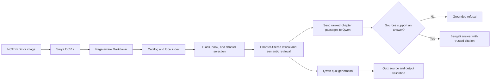

# পাঠসঙ্গী (Pathshongi)

পাঠসঙ্গী is a local-first Bengali textbook assistant. It converts NCTB textbook PDFs into page-aware Markdown or JSON, indexes approved books, answers Bengali or English questions in Bengali, and creates chapter-scoped quizzes with validated textbook sources.

The application is designed to run locally without paid APIs. Reviewed Markdown sources are versioned with the project; source PDFs, search indexes, model files, logs, and generated OCR output remain on the computer and are not committed to Git.

## What the project does

- Uses a catalog-driven Bengali/English interface for class, book, and chapter selection.
- Stores chapter identity on every indexed chunk and retrieves evidence only from the selected chapter.
- Combines lexical matching with local semantic embeddings.
- Refuses unsupported questions with a deterministic Bengali response.
- Requires generated answers to cite trusted chunk IDs and real book pages.
- Creates MCQ and short-answer knowledge quizzes, then validates their sources, options, answers, and duplicates before displaying them.
- Converts PDFs or page images to parser-compatible Markdown or detailed JSON with the optional Surya OCR 2 module.
- Trains BanglaBERT only as a question-to-chapter classifier, using no answers or answer spans.
- Uses the local Qwen service for grounded answers and quizzes, and EmbeddingGemma for optional semantic retrieval.
- Reports the selected answer model, end-to-end response time, and confidence in the web conversation.

## Data flow



## Included content

The current catalog registers:

| ID | Textbook | Class | Chapters |
| --- | --- | --- | ---: |
| `physics-9-10` | Physics | 9–10 | 13 |

Additional Markdown may exist under `dataset/raw/`, but a book is available in the application only after it is registered in `config/books.json` and the index is rebuilt.

## Requirements

- Windows 10/11 and PowerShell (the Python modules also work on other platforms, but the launch helpers are PowerShell-based)
- Python 3.11 or 3.12
- A recent `llama-server` executable and `Qwen3-4B-Q4_K_M.gguf` for answers and quizzes
- Optional for semantic retrieval: the configured embedding model/service
- Internet access on first setup if model files are not already cached
- Optional for PDF/image conversion: the dependencies in `requirements-ocr.txt`

Model binaries are intentionally excluded from Git because they are large. Put the Qwen model at `.runtime/models/Qwen3-4B-Q4_K_M.gguf`. Put `llama-server.exe` at `.runtime/llama.cpp/llama-server.exe`, or set `PATHSHONGI_LLAMA_SERVER` to its location. The optional question-only BanglaBERT classifier exports to `.runtime/models/pathshongi-banglabert-physics-chapters` but is never used to supply answer text.

## Quick start on Windows

Open PowerShell in the repository and create the local environment:

```powershell
python -m venv ".venv"
& ".\.venv\Scripts\python.exe" -m pip install --upgrade pip
& ".\.venv\Scripts\python.exe" -m pip install -r ".\requirements.txt"
```

Configure a custom llama.cpp location if it is not stored inside this project:

```powershell
$env:PATHSHONGI_LLAMA_SERVER = "C:\tools\llama.cpp\llama-server.exe"
```

Start the optional quiz and semantic-retrieval services in one terminal:

```powershell
& ".\scripts\start-local-model.ps1"
```

Build the hybrid textbook index in another terminal while those services are running:

```powershell
& ".\.venv\Scripts\python.exe" -m bangla_rag ingest
```

Then start the web interface:

```powershell
& ".\scripts\start-gui.ps1"
```

Open <http://127.0.0.1:8000>. API documentation is available at <http://127.0.0.1:8000/api/docs>.

After the environment, local model, and index are ready, `Launch-Pathshongi.cmd` starts the app and opens the browser. Answers and quizzes are unavailable when Qwen is absent. `Stop-Pathshongi.cmd` stops only processes recorded by that launcher.

## Quick start on Linux

After creating `.venv` and installing `requirements.txt`, run:

```bash
./Launch-Pathshongi.sh
```

The launcher builds a lexical index when no index exists, starts any locally installed llama.cpp services, starts the web app, records its process IDs under `.runtime/`, and opens the browser. Without Qwen, retrieval diagnostics remain available but answers and quizzes do not.

Stop only the launcher-managed processes with:

```bash
./Stop-Pathshongi.sh
```

Use `./Launch-Pathshongi.sh --port 8001` to select a different GUI port, or add `--no-browser` when running without a desktop session.

To download and install the official CPU llama.cpp runtime and Qwen3-4B Q4_K_M model into `.runtime/`, run:

```bash
./Install-Pathshongi-Model.sh
```

The download is resumable. Restart Pathshongi afterward so the launcher can start the optional quiz and embedding services.

## OCR: convert a textbook to Markdown or JSON

Install the optional OCR dependencies:

```powershell
& ".\.venv\Scripts\python.exe" -m pip install -r ".\requirements-ocr.txt"
```

For CPU inference, configure Surya to use llama.cpp:

```powershell
$env:SURYA_INFERENCE_BACKEND = "llamacpp"
$env:LLAMA_CPP_BINARY = $env:PATHSHONGI_LLAMA_SERVER
$env:LLAMA_CPP_NGL = "0"
$env:SURYA_INFERENCE_PARALLEL = "1"
$env:HF_HOME = "$PWD\.runtime\huggingface"
```

Run a short smoke test before converting a full book:

```powershell
& ".\.venv\Scripts\python.exe" -m bangla_ocr ".\NCTB-Books\book.pdf" `
  -o ".\ocr-output\book-smoke.json" --pages 1-3 --dpi 96
```

Convert the complete book to Markdown:

```powershell
& ".\.venv\Scripts\python.exe" -m bangla_ocr ".\NCTB-Books\book.pdf" `
  -o ".\dataset\raw\book.md" --dpi 300
```

OCR processes one page at a time and shows live terminal progress. Markdown output uses `## পৃষ্ঠা N` headings, which the textbook parser uses for real page citations. JSON output can additionally preserve confidence, layout labels, polygons, and bounding boxes.

Review OCR output before indexing it. The converter does not automatically trust, register, or index a new book.

## Add another textbook

1. Put reviewed page-aware Markdown under `dataset/raw/`.
2. Add the book, bilingual class/subject labels, chapters, page ranges, and Markdown path to `config/books.json`.
3. Keep book IDs unique and reuse a subject ID for books in the same subject.
4. Rebuild the index with `python -m bangla_rag ingest`.
5. Run the tests and retrieval evaluation before using the new book.

The GUI reads the catalog dynamically, so a catalog update does not require editing the HTML or JavaScript.

## Command-line tools

```powershell
# Inspect retrieval and evidence-gate diagnostics
& ".\.venv\Scripts\python.exe" -m bangla_rag search "নিউটনের দ্বিতীয় সূত্র কী?" --book physics-9-10 --chapter 3 --debug

# Ask one question
& ".\.venv\Scripts\python.exe" -m bangla_rag ask "নিউটনের দ্বিতীয় সূত্রটি ব্যাখ্যা করো।" --book physics-9-10 --chapter 3

# Generate a grounded quiz
& ".\.venv\Scripts\python.exe" -m bangla_rag quiz "বল ও নিউটনের সূত্র" `
  --book physics-9-10 --chapter 3 --type mcq --count 10 --output ".\quiz\newton.json"

# Evaluate the bundled retrieval/refusal cases
& ".\.venv\Scripts\python.exe" -m bangla_rag evaluate

# Test an imported question-only BanglaBERT chapter classifier
& ".\.venv\Scripts\python.exe" -m bangla_rag classify "নিউটনের দ্বিতীয় গতিসূত্র কী?" --top-k 3

# Check the index and local model connection
& ".\.venv\Scripts\python.exe" -m bangla_rag doctor
```

For a retrieval trial without the embedding service, build a lexical-only index with `python -m bangla_rag ingest --lexical-only`. Grounded answers and quizzes still require Qwen.

## API

| Method | Endpoint | Purpose |
| --- | --- | --- |
| `GET` | `/api/health` | Index, embedding mode, and model readiness |
| `GET` | `/api/catalog` | Available classes, subjects, books, and chapters |
| `POST` | `/api/ask` | Chapter-scoped grounded question answering |
| `POST` | `/api/quiz` | Book- and chapter-scoped quiz generation |

Requests must include a valid indexed `book_id` and `chapter_id`. Unknown, mismatched, or unindexed scopes are rejected before generation.

## Project structure

```text
bangla_ocr/          Optional PDF/image OCR and Markdown/JSON formatting
bangla_rag/          Parsing, chunking, indexing, retrieval, QA, quiz, and API
config/              Runtime settings and catalog metadata
dataset/raw/         Reviewed page-aware textbook Markdown
evaluation/          Retrieval/refusal evaluation cases
scripts/             Windows launch and stop helpers
tests/               Core, web API, and OCR tests
web/static/          Bengali/English student interface
```

Generated indexes, model files, caches, logs, PIDs, source PDFs, and OCR scratch output are ignored by Git.

## Validation and safety boundaries

- Retrieval scores rank passages but never reject a question before the model reads selected-chapter context.
- Qwen must refuse when the supplied chapter sources do not explicitly support an answer.
- Retrieval and generation are hard-filtered by the selected `(book_id, chapter_id)` pair.
- BanglaBERT training consumes only question text and chapter labels; it never receives answer text.
- Citations are constructed from trusted index metadata, not model-written page numbers.
- Quiz questions are withheld unless their source IDs and required answer fields validate.
- The fixed unsupported-question response is: `এই অধ্যায়ে এই প্রশ্নের উত্তর পাওয়া যায়নি।`
- This is an educational local assistant, not an authoritative replacement for the textbook or teacher review.

Run the complete automated suite with:

```powershell
& ".\.venv\Scripts\python.exe" -m pytest -q
```

## Configuration

`config/settings.json` controls local service URLs, model aliases, chunk sizes, retrieval thresholds, passage limits, and timeouts. The defaults expect:

- grounded answer and quiz generation at `http://127.0.0.1:8080/v1`
- embeddings at `http://127.0.0.1:8081/v1`

Thresholds are starter values calibrated for the bundled books and evaluation cases. Re-evaluate them after changing the embedding model, corpus, chunking, or catalog.

Qwen confidence is the model's self-reported estimate of how directly its cited textbook source supports the answer; it is useful as an indicator, not a calibrated probability.

For the fresh question-only BanglaBERT notebook, validation steps, Colab
instructions, and checkpoint import procedure, see
[`BANGLABERT_CHAPTER_TRAINING.md`](BANGLABERT_CHAPTER_TRAINING.md).
